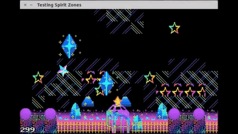

# Spirit Zones

Two souls traverse the various afterlifes called
"spirit zones" in order to find their own.

**Please read the `AUTHORS.md` file.** Many people, artists, devs have
contributed to this project.

Donate to [SlimeMaid's Patreon](https://www.patreon.com/SlimeMaid) to get access
to the Windows, Mac, Linux installers/binaries *and* fund this project.
Otherwise you can play and edit the game (with ease!) using
[the OHRRPGCE game engine](http://rpg.hamsterrepublic.com/ohrrpgce/Main_Page).

## Currently in alpha

This game is so far from complete it's not even funny. Really, this game is in
its infancy, far from its completed product.

## How's it made?

Created with [OHRRPGCE](http://rpg.hamsterrepublic.com/ohrrpgce/Main_Page),
VIM (for the code), and GIMP (for the "screens"), mostly.

The primary developer uses WINE on Ubuntu to run both `OHRRPGCE-CUSTOM.exe`
to both edit the game and test it.

### Edit

Pretty much everything is in the `spirit-zones.rpgdir` directory, except for the
HamsterSpeak/plotscripts in `scripts/`. I used
[unlump](https://rpg.hamsterrepublic.com/ohrrpgce/UNLUMP) to "unlump" the
OHRRPGCE `.rpg` file, as to avoid `git` creating a new version of the entire
project every single little change.

I highly recommend the official
[Dictionary of Plotscripting Commands](http://hamsterrepublic.com/ohrrpgce/plotdictionary.html).

You can modify this game by editing `spirit-zones.rpg` with the
[OHRRPGCE game editor](http://rpg.hamsterrepublic.com/ohrrpgce/Downloads),
which is available for a variety of platforms (including Android!).

## How to play

`ESC` exits menus/cancels, but if there are no menus up it brings up the main
game menu.

`ENTER` is your use/activate/accept key.

The arrow keys are for selecting things and moving.

## Other

I keep a `CHANGELOG.md` and also a `nextrelease` branch, where I pretty much
do all my work on before merging back to `master` due to the nature of `OHRRPGCE`.
